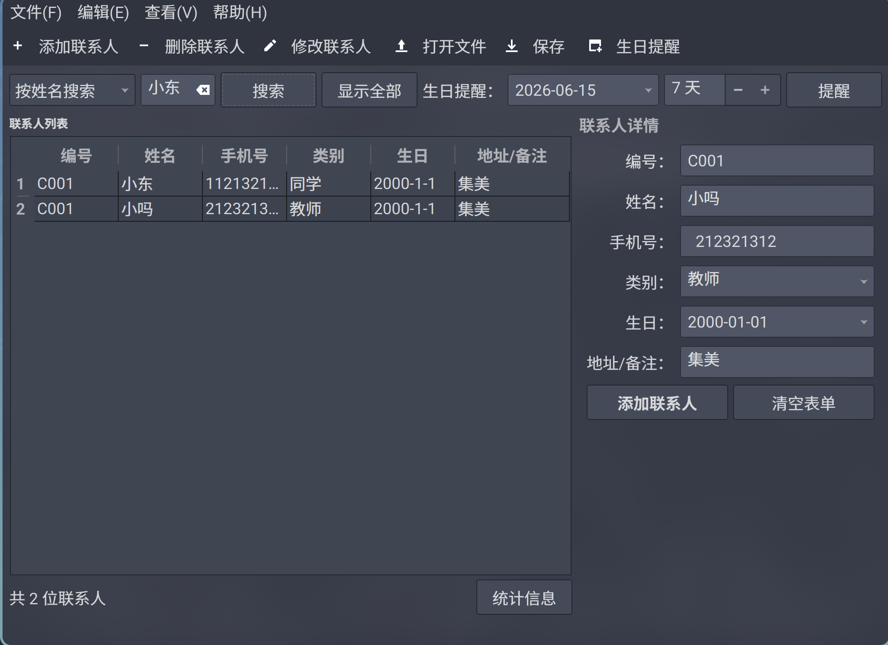

# 校园通讯录管理系统的设计与实现
XMUT 大一下程序设计实践必做题  

## 🌴效果


## ❗声明
本项目除了 `mainwindow.ui` 使用 claude code 接入 deepseek-v4-pro 大模型生成之外，其余代码皆为 qt creator IDE 创建框架，自己手搓实现。  
大模型在本项目中只有限制的用于 debug 调试和 qt6 文档解释。  
## 🍉框架
采用 QT6 C++ 库。采用 QWidget  

## 🏗️代码结构
### main.cpp
启动窗口  

###  mainwindow
窗口交互逻辑  

``` cpp
extern contactsList conList;
```

全局变量对象  
#### `MainWindow::MainWindow(QWidget *parent) : QMainWindow(parent), ui(new Ui::MainWindow)`
窗口配置。连接槽。  

#### `MainWindow::~MainWindow()`
析构 MainWindow  

#### `bool MainWindow::addContacts()`
添加新的联系人，按下添加联系人按钮时运行该函数。  
#### `bool MainWindow::updateContacts()`
更新联系人列表。在 addContacts 函数最后执行该函数，更新联系人列表。  

#### `bool MainWindow::clearForm()`
清理表单，按下清空表单按钮的时候出发。  

#### `bool MainWindow::searchClicked()`
按下搜索按钮的时候触发。目前实现了按姓名搜索和按电话号码搜索，还有 bug，没完全实现。  

#### `bool MainWindow::actionAddItem()`
添加联系人 toolbutton ，弹出新窗口  

#### `bool MainWindow::actionDelItem()`
删除选中的联系人列表  

#### `bool MainWindow::actionModifyItem()`
tty(0.47.1)修改列表项，点击后使表格可修改，修改完成再点击一次保存修改并且表格变成不可修改。  

#### `bool MainWindow::actionOpenCsv()`
打开新的 csv 文件，并修改 contactslist.data  和 path  

#### `bool MainWindow::actionSaveCsv()`
保存到新的 csv 文件，并修改 contactsList.data 和 path

#### `bool MainWindow::statistics()`
点击统计信息时触发，弹出统计信息窗口  
目前统计联系人数量和各类型数量  
### date
日期类  
#### `const QString Date::text() const`
输出字符串。  
这两 const 真的是自己写的！！！  

### contacts
联系人类  
``` cpp
    QString id;
    QString name;
    QString phoneNumber;
    QString type;
    Date Birth;
    QString remarks;
```

目前就是 get 和 set 两种函数，所有数据都实现了一遍，确保封装性。  

``` cpp
enum typeList
{
    schoolmates = 0,
    teachers,
    family,
    clubs,
    other
};
```

对类型做 enum 方便后续处理。  
### contactslist
联系人列表  

typeMap 保存当前的存储的类型的统计。  
``` cpp
std::map<int, int> typeMap{{Contacts::schoolmates, 0},
                           {Contacts::teachers, 0},
                           {Contacts::family, 0},
                           {Contacts::clubs, 0},
                           {Contacts::other, 0}};
```


#### `bool contactsList::addNewContacts(Contacts ct)`
添加新的联系人  

#### `bool contactsList::removeContacts()`
删除列表项

#### `bool contactsList::modifyContacts()`
从 QTable 中加载回 contactsList.data  


#### `const std::vector<Contacts>& contactsList::readContactList() const`

#### `bool contactsList::readcsv()`
读取 csv 文件  

#### `bool contactsList::saveContacts()`
保存联系人列表到 csv 文件中

#### `size_t contactsList::size()`
返回 data 大小。  

#### `const std::map<int, int> &contactsList::getTypeListMap()`
返回常量化的 TypeMap  

返回数据数组。  
### search
搜索基类  

### searchbyname
按姓名搜索子类  

### searchbynumber
按电话号码搜索子类  

### statistics
统计输出类  

### addnewcontacts

### csv_file
文件读写到 csv 文件

#### `std::vector<std::vector<std::string>> csv_file::load_from_csv(const char *path)`
加载 csv 文件

#### `bool csv_file::write_to_csv(const char *path, std::vector<std::vector<std::string>> data)`
写入 csv 文件  

#### `std::vector<std::string> csv_file::division(const std::string &line)`
按逗号分块，这块原本用 getline 会忽略空项，还是自己写字符串解析比较好。  
## 🏁进度
- [x] Contact 初始化
- [x] 添加联系人 toolBar 子窗口实现
- [ ] 搜索
- [x] 删除选中项
- [x] 文件读写——数据持久化
- [x] 保存文件
- [ ] 日期算法
- [ ] 排序算法
- [x] 联系人修改
- [ ] 生日提醒
- [ ] 菜单栏补全
